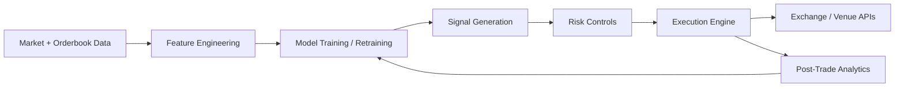
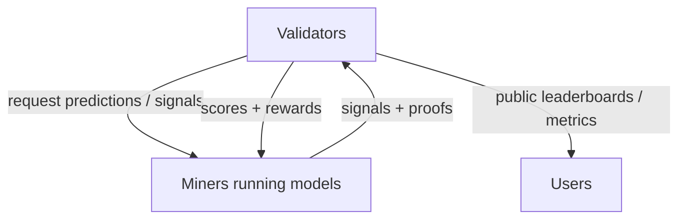

# Deep Research Report on Public GitHub Repositories for AI-Driven Crypto Trading and AI-Driven Crypto Mining Economics

## Executive summary

This research identifies and prioritizes 20 public repositories on entity["company","GitHub","code hosting platform"] that are most practically useful for building AI-enabled crypto trading systems, and, to a smaller extent, AI-enabled mining economic decision systems, under a strict evidence rule: profitability claims are treated as unverified unless the repository (or its linked paper) provides reproducible backtests, clearly defined metrics, and enough methodological detail to reduce survivorship, leakage, and execution-bias risk. citeturn20view3turn14view0turn24view0turn8view0

Across the ecosystem, the strongest “buildable” foundations for real-world crypto trading are production-grade bot frameworks and execution/backtesting engines, particularly those that explicitly support (a) robust backtesting, (b) live deployment with minimal code changes, and (c) ML components that retrain and evaluate in a way that mimics live conditions. The leading examples in this set are: freqtrade/freqtrade (notably its FreqAI subsystem), hummingbot/hummingbot, jesse-ai/jesse, nautechsystems/nautilus_trader, and nkaz001/hftbacktest. citeturn21view0turn22search1turn1search4turn2search2turn15search0turn14view0

Cutting-edge “innovation” and explicit AI novelty tends to cluster in research repositories tied to recent papers, and these often prioritize reproducibility over production deployment. In this list, the most research-forward crypto-relevant AI repos include ZONG0004/MacroHFT (KDD 2024) and AIGeeksGroup/WebCryptoAgent (arXiv 2026), with the important caveat that these provide backtesting workflows rather than full production trading systems. citeturn3search3turn3search9turn5view0turn5view1

On the mining side, open-source “AI to optimize mining rigs” is comparatively scarce in reputable public repositories. The most concrete, recent, and academically framed mining-related AI repository found here is AMAAI-Lab/MineROI-Net, which models the timing decision for purchasing ASIC mining hardware, and reports classification metrics tied to ROI categories. This is not a hash-rate optimizer, it is a capital-allocation and timing model. citeturn8view0turn11search7

A distinct “profit generation” pathway that is not traditional trading is the emergence of entity["organization","Bittensor","decentralized ML network"] subnets framed as mining-like competitions, where “miners” run models and earn rewards based on performance scoring. In this set, taoshidev/vanta-network and CandlesTAO/candles exemplify this approach for trading signals and candle prediction, respectively, but their economics and compliance posture differ materially from conventional exchange trading. citeturn16search9turn16search0turn16search15

## Methodology and evaluation rubric

This report followed a two-stage discovery strategy: first via entity["company","Hugging Face","ai model hub"] “Papers” and linked code pointers (to surface recent, paper-backed innovation), then via targeted web discovery of highly used trading frameworks and execution engines. citeturn3search3turn5view0turn20view3turn15search0

Selection and prioritization used an evidence-bound rubric:

Relevance and function fit: crypto trading bot, signal generator, RL training code, HFT backtester/execution engine, mining economics model (ROI, capex timing).

AI specificity: explicit ML/RL/LLM/transformer methods are preferred over “technical indicators only,” unless the repository is a best-in-class deployment substrate.

Operational completeness: presence of backtesting, live trading integration, risk controls, and clear data ingestion requirements.

Evidence of profitability: graded as (a) none, (b) backtesting workflow exists but results not substantiated, (c) paper-backed results with metrics and reproducibility pointers, (d) audited live results. In this corpus, (d) was not found in a robust form; most claims remain in (b) or (c). citeturn24view0turn3search9turn5view1turn17view0

Maintenance and trust signals: stars, forks, releases, and observable recent commit activity, when available from commit logs or release cadence. citeturn20view3turn21view0turn14view0turn15search0

A practical architecture for building profit-tested systems that integrates many of these repos looks like the following:

This pipeline is explicitly supported end-to-end by some frameworks (notably freqtrade/freqtrade with FreqAI) and, in a different engineering style, by event-driven engines like nautechsystems/nautilus_trader and nkaz001/hftbacktest. citeturn22search1turn15search0turn14view0

## Hugging Face connector findings

The most actionable connector-derived findings were recent AI-for-trading papers that include direct code links to public repositories:

MacroHFT (KDD 2024): Hugging Face’s paper page points to the method’s focus on memory augmentation and context-aware reinforcement learning for minute-level high-frequency trading in cryptocurrency markets, and links to its GitHub implementation. citeturn3search3turn3search9

WebCryptoAgent (arXiv 2026): Hugging Face’s paper page describes an agentic framework that integrates heterogeneous web information with a decoupled real-time risk control model, and links to a GitHub repository. citeturn5view0turn5view1

FinRL-DeepSeek (arXiv 2025): The paper page states the approach combines risk-sensitive RL with LLM-derived signals from news, and includes a direct GitHub link for code, data references, and backtesting notebooks. citeturn3search2turn3search6

Additionally, the mining-economics model MineROI-Net appears both as a GitHub repository and as a Hugging Face-hosted model/space with an Apache-2.0 license marker, indicating an intent to provide an interactive demo layer atop the research model. citeturn11search0turn8view0

These connector-led items are disproportionately valuable because they anchor “innovative” claims in paper-backed methodologies, even when production readiness remains limited. citeturn3search3turn5view0turn3search2

## Prioritized repository entries with concise technical summaries

The table below compares the top 20 repositories across the requested attributes. Where an attribute could not be verified from captured sources, it is reported as Unknown and carried into the verification queue.

### Comparison table for top repositories

| Rank | Repository (GitHub) | Repo URL | Primary function | Key algorithms/models | Data sources required | Deployment requirements | Evidence of profitability | Activity and maintenance | Stars, forks | License | Key risks and concerns |
|---:|---|---|---|---|---|---|---|---|---|---|---|
| 1 | entity["organization","freqtrade/freqtrade","crypto trading bot"] citeturn20view3turn22search1turn21view0 | `https://github.com/freqtrade/freqtrade` | Crypto trading bot with backtesting, optimization, UI, and adaptive ML via FreqAI citeturn20view3turn22search1 | FreqAI “sandbox” supports model examples incl. LightGBM, CatBoost, CNN, PCA, outlier removal (SVM, DBSCAN) citeturn22search5turn22search1 | Exchange OHLCV and related market data; exchange connectors listed in repo citeturn20view3 | Python 3.11+, Docker recommended, modest VM specs suggested citeturn20view3 | Framework provides realistic backtesting and retraining workflow, but profits depend on strategy, no universal audited profits citeturn22search1turn20view3 | Last commit date visible in commit log (Apr 11, 2026), active releases (2026.3 on Mar 30, 2026) citeturn21view0turn20view3 | 48.6k, 10.1k citeturn20view3 | GPL-3.0 citeturn20view3 | Real-money loss risk; exchange policy compliance; model leakage and overfitting risk if misused citeturn20view3turn22search1 |
| 2 | entity["organization","hummingbot/hummingbot","crypto trading framework"] citeturn1search4turn1search7 | `https://github.com/hummingbot/hummingbot` | High-frequency crypto trading bot framework, oriented to market making and algorithmic strategies citeturn1search4turn1search7 | Strategy framework, not inherently ML-first in captured sources; can be extended by users (Unknown for built-in ML modules in this extraction) citeturn1search7 | Exchange and market data via connectors (implied by framework purpose) citeturn1search4 | Python-based deployment; ecosystem includes dashboard tool for managing instances citeturn1search4 | No standardized profitability evidence in captured sources citeturn1search7 | Repo stats from org page indicate strong adoption; last commit date not captured here citeturn1search4 | 15.5k, 4.2k citeturn1search4 | Apache-2.0 citeturn1search4 | Execution risk in HFT-like strategies; venue rules; latency and adverse selection in market making citeturn1search7 |
| 3 | entity["organization","jesse-ai/jesse","crypto trading framework"] citeturn2search2turn2search6 | `https://github.com/jesse-ai/jesse` | Crypto trading framework for backtesting, optimization, and live or paper trading citeturn2search2 | Uses Optuna for optimization and mentions an “AI assistant” for strategy development (assistant details not technically specified in captured text) citeturn2search2 | Candlestick data and exchange data for backtests and live trading (implementation-specific) citeturn2search2 | Self-hosted; designed to keep strategy and data private; supports notifications and monitoring citeturn2search2 | No general profitability results provided in captured sources citeturn2search2 | Updated Jan 7, 2026 per org listing citeturn2search6 | 7.3k, 1k citeturn2search2 | MIT citeturn2search2 | Overfitting and backtest realism; operational risk in live deployment; exchange compliance citeturn2search2 |
| 4 | entity["organization","nautechsystems/nautilus_trader","algo trading platform"] citeturn15search0turn26search0 | `https://github.com/nautechsystems/nautilus_trader` | Production-grade event-driven backtester and live trading platform, marketed as AI-first citeturn15search0 | Designed for parity between research backtest and production live code; supports using backtest engine to train AI agents (RL/ES) citeturn15search0 | Supports numerous venue adapters, including multiple crypto venues and data providers citeturn15search0 | Hybrid Python and Rust core; supports Docker; optional Redis; released wheels and attestations mentioned citeturn15search0turn26search0 | Not a strategy repo; profitability depends on user strategies, not evidenced here citeturn15search0 | Strong release cadence, latest release 1.222.0 in early Jan 2026 citeturn26search0turn15search0 | 17.3k, 2.1k citeturn15search0 | LGPL-3.0 citeturn15search0 | Complexity and operational correctness demands; strategy risk remains user responsibility citeturn15search0 |
| 5 | entity["organization","nkaz001/hftbacktest","hft backtesting tool"] citeturn14view0 | `https://github.com/nkaz001/hftbacktest` | HFT backtesting tool emphasizing latency, queue position, and tick-level realism; includes live bot deployment support for specific venues citeturn14view0 | Numba JIT functions for fast simulation; focuses on execution realism rather than ML per se citeturn14view0 | Full order book and trade tick data (L2/L3), plus venue-specific formats citeturn14view0 | Python 3.11+; Rust-only live bot support for Binance Futures and Bybit per README citeturn14view0 | Emphasizes aligning backtest to live outcomes as a prerequisite; does not supply universal profitable strategy evidence citeturn14view0 | High commit count (1,038 commits in repo listing) and active documentation citeturn14view0 | 3.9k, 762 citeturn14view0 | MIT citeturn14view0 | Misinterpreting execution realism; high data requirements; venue policy compliance citeturn14view0 |
| 6 | entity["organization","Superalgos/Superalgos","crypto trading platform"] citeturn23view3turn23view2 | `https://github.com/Superalgos/Superalgos` | Visual platform for data mining, backtesting, paper trading, live sessions, and multi-server deployments citeturn12view0turn23view2 | Mentions partial TensorFlow integration for Windows users (details not fully extracted) citeturn23view3 | Exchange and platform data (implementation-specific) citeturn23view2 | Desktop and server deployment options described via tutorials and headless setups citeturn23view3turn23view2 | No standardized profitability evidence surfaced in captured sources citeturn23view3 | Latest release Nov 2, 2024; community activity implied by issues and PR counts citeturn23view3 | 5.4k, 6.1k citeturn23view3 | Apache-2.0 citeturn23view3 | Complexity, learning curve; model correctness depends on user implementation citeturn23view2 |
| 7 | entity["organization","AI4Finance-Foundation/FinRL_Crypto","crypto drl trading"] citeturn24view0 | `https://github.com/AI4Finance-Foundation/FinRL_Crypto` | DRL crypto trading repo focused on reducing backtest overfitting; includes download, validation, and backtest scripts citeturn24view0 | DRL algorithms listed (PPO, A2C, DDPG, TD3, SAC); uses CPCV, walk-forward, and K-fold procedures; computes PBO citeturn24view0 | Binance data download scripts; configurable ticker lists and indicators citeturn24view0 | Python 3.10 recommended; requires Binance API keys citeturn24view0 | Claims tested across multiple coins and a crash period, “more profitable than competition,” but claim remains unverified here without extracted paper metrics citeturn24view0 | Stars and forks moderate; last commit date not extracted in this snippet set citeturn24view0 | MIT citeturn24view0 | Overfitting remains central risk; live deployment hazards; API key security citeturn24view0 |
| 8 | entity["organization","AI4Finance-Foundation/FinRL","financial rl library"] citeturn25view0 | `https://github.com/AI4Finance-Foundation/FinRL` | Financial reinforcement learning framework with a crypto trading application folder citeturn4search13turn25view0 | DRL agents listed (A2C, DDPG, PPO, SAC, TD3); library emphasizes train-test-trade pipeline citeturn25view0 | Multiple processors and data sources; includes crypto trading application scaffold citeturn25view0 | Python-based; production-oriented successor repo (FinRL-Trading) is recommended for modern deployment citeturn25view0 | Research framework, not a direct profitability guarantee citeturn25view0 | Large community adoption; last commit date not extracted here citeturn25view0 | 14.7k, 3.3k citeturn25view0 | MIT citeturn25view0 | Research-to-production gap; leakage, slippage, and transaction cost modeling issues if not handled citeturn25view0 |
| 9 | entity["organization","tensortrade-org/tensortrade","rl trading framework"] citeturn2search0turn2search1 | `https://github.com/tensortrade-org/tensortrade` | RL framework for training and deploying trading agents citeturn2search0 | Uses gym-style environments; integrates numpy, pandas, keras, tensorflow; modular RL agent design citeturn2search0 | User-provided trading data pipelines citeturn2search0 | Python 3.11.9+; Docker support for notebooks and docs citeturn2search0 | No specific profitability evidence included in extracted text citeturn2search0 | Marked “beta,” and repo shows last update Jun 9, 2024 in org summary citeturn2search1 | 5.7k, 1.2k citeturn2search0 | Apache-2.0 citeturn2search0 | Production caution noted; RL instability; backtest realism varies by environment design citeturn2search0 |
| 10 | entity["organization","ZONG0004/MacroHFT","kdd 2024 hft rl"] citeturn3search3turn3search9 | `https://github.com/ZONG0004/MacroHFT` | Official implementation of MacroHFT for high-frequency crypto RL citeturn3search9 | Memory-augmented, context-aware RL with sub-agents and a hyper-agent per paper description citeturn3search3turn3search9 | Dataset hosted on Google Drive (external download) citeturn3search9 | Research code with scripts for decomposition and training phases citeturn3search9 | Paper reports state-of-the-art performance; repository itself does not surface audited live profitability citeturn3search3turn3search9 | Stars, forks, license not captured in extracted sources citeturn3search9 | Unknown | Risk of research-to-production gap; dataset availability and comparability constraints citeturn3search9turn3search3 |
| 11 | entity["organization","AIGeeksGroup/WebCryptoAgent","agentic crypto trading"] citeturn5view0turn5view1 | `https://github.com/AIGeeksGroup/WebCryptoAgent` | Backtesting workflow for agentic crypto trading decisions, not a production bot citeturn5view1 | Requires LLM API keys; focuses on offline backtesting of model-driven decisions citeturn5view1turn5view0 | User-supplied OHLCV CSVs; optional custom ticker endpoint citeturn5view1 | Python dependencies plus external LLM API access; explicit non-production scope citeturn5view1 | Paper claims improved stability and tail-risk handling, but repo emphasizes offline backtest workflow citeturn5view0turn5view1 | Repo shows 3 commits, 7 stars, 0 forks in captured view citeturn5view1 | Unknown | Reliance on paid LLM APIs; reproducibility depends on data and prompt stability; not production-ready citeturn5view1 |
| 12 | entity["organization","benstaf/FinRL_DeepSeek","llm infused rl trading"] citeturn3search2turn3search6 | `https://github.com/benstaf/FinRL_DeepSeek` | Code for LLM-infused, risk-sensitive RL trading agents (not crypto-specific in paper, but method relevant) citeturn3search6turn3search2 | PPO and CVaR-augmented PPO variants; adds risk and sentiment signals from LLMs over financial news citeturn3search2turn3search6 | Uses FNSPID news dataset and additional derived datasets hosted on Hugging Face citeturn3search6 | High-memory compute recommendation (Ubuntu server 128GB RAM suggested); MPI-based training runs provided citeturn3search6 | Provides explicit backtesting notebook and metrics (Information Ratio, CVaR, Rachev Ratio) but still backtest-bound citeturn3search6turn3search2 | 288, 94 citeturn3search6 | MIT citeturn3search6 | News-driven models risk regime shifts and data leakage; external API dependencies for LLM signals citeturn3search6 |
| 13 | entity["organization","taoshidev/vanta-network","bittensor trading subnet"] citeturn16search0turn13view0turn16search9 | `https://github.com/taoshidev/vanta-network` | Decentralized trading-signal “mining” network on Bittensor: miners submit signals, validators score and reward citeturn13view0turn16search9 | Model-agnostic, miners can use quant or deep learning trading systems; scoring includes drawdown constraints citeturn13view0 | Network-defined supported trade pairs; miners submit long/short/flat signals citeturn16search0 | Requires running miner or validator infrastructure on Bittensor subnet; not a conventional exchange bot citeturn13view0turn16search9 | Mentions “millions of $ payouts” and ranking based on returns under drawdown limits, but independent verification not captured here citeturn13view0 | 71, 32 citeturn13view0 | MIT indicated in README badge area citeturn13view0 | Token and incentive-mechanism risk; plagiarism detection and elimination rules; regulatory uncertainty differs from exchange trading citeturn13view0turn16search9 |
| 14 | entity["organization","CandlesTAO/candles","candle prediction subnet"] citeturn16search15turn16search9 | `https://github.com/CandlesTAO/candles` | Candle prediction competition subnet on Bittensor citeturn16search15turn16search9 | Prediction-task framing; model choice left to miners (no specific ML declared in extracted snippet) citeturn16search15 | Validator compares predictions against market data citeturn16search15 | Subnet miner and validator roles; infrastructure requirements depend on subnet implementation citeturn16search15turn16search9 | No profitability evidence captured, rewards are performance-based emissions citeturn16search15turn16search9 | 1, 4 citeturn16search15 | MIT citeturn16search15 | Incentive gaming risk; unclear mapping from prediction accuracy to tradable profits citeturn16search15 |
| 15 | entity["organization","taoshidev/time-series-prediction-subnet","bittensor prediction subnet"] citeturn16search3turn16search9 | `https://github.com/taoshidev/time-series-prediction-subnet` | General prediction subnet on Bittensor citeturn16search3turn16search9 | Not specified in extracted text citeturn16search3 | Not specified in extracted text citeturn16search3 | Bittensor subnet miner/validator architecture citeturn16search3turn16search9 | Not specified in extracted text citeturn16search3 | Stars, forks, license not captured in extracted text citeturn16search3 | Unknown | Same as other incentive networks, plus task-definition risk citeturn16search3turn16search9 |
| 16 | entity["organization","EfficientFrontier-SignalPlus/EfficientFrontier","bittensor trading strategies"] citeturn16search14turn16search9 | `https://github.com/EfficientFrontier-SignalPlus/EfficientFrontier` | Bittensor-linked initiative aiming to discover optimal crypto trading strategies citeturn16search14turn16search9 | Not specified in extracted text citeturn16search14 | Not specified in extracted text citeturn16search14 | Likely subnet and platform integration (not fully extracted) citeturn16search14turn16search9 | Not specified in extracted text citeturn16search14 | Stars, forks, license not captured in extracted text citeturn16search14 | Unknown | Incentive and compliance risks depend on actual deployment model citeturn16search14turn16search9 |
| 17 | entity["organization","AMAAI-Lab/MineROI-Net","bitcoin mining roi model"] citeturn8view0turn11search7turn11search0 | `https://github.com/AMAAI-Lab/MineROI-Net` | Deep learning model for timing ASIC mining hardware purchases based on ROI classification citeturn8view0turn11search7 | Transformer-based architecture with FFT spectral extractor and channel-mixing module; predicts ROI categories citeturn8view0turn11search7 | Bitcoin network and price features (blockchain.info API), ASIC pricing (Hashrate Index API), electricity price data citeturn8view0 | PyTorch training code; data reconstruction required due to pricing restrictions; demo exists on Hugging Face citeturn8view0turn11search0 | Reports accuracy and macro-F1, plus precision on profitable/unprofitable periods (paper summary) but this is predictive, not guaranteed profit generation citeturn11search7turn8view0 | 8, 0 citeturn8view0 | Hugging Face model lists Apache-2.0; GitHub license not extracted here citeturn11search0turn8view0 | Economic regime change; data-source dependence; not a mining rig controller, a capex timing aid citeturn8view0turn11search7 |
| 18 | entity["organization","AMAAI-Lab/PreBit","bitcoin price movement model"] citeturn17view0 | `https://github.com/AMAAI-Lab/PreBit` | Multimodal model for extreme Bitcoin price movement prediction, with a backtested trading strategy citeturn17view0 | FinBERT embeddings over tweets plus CNN; ensemble with candlestick and correlated asset features citeturn17view0 | Twitter-derived dataset (Kaggle link), plus market and correlated asset time series citeturn17view0 | Notebook-based research workflow citeturn17view0 | Claims backtested strategy can be profitable with reduced risk vs hold or moving average, but exact numerical verification not extracted here citeturn17view0 | 12, 6 citeturn17view0 | Unknown | Social data drift, data licensing and access constraints; horizon mismatch to execution realities citeturn17view0 |
| 19 | entity["organization","jwallbridge/translob","lob transformer code"] citeturn4search8 | `https://github.com/jwallbridge/translob` | Research code for transformer-based prediction from limit order book data citeturn4search8 | CNN feature extraction followed by transformer attention over LOB features citeturn4search8 | LOB data (venue-specific; not specified in captured snippet) citeturn4search8 | Research code, “some assembly required” per README citeturn4search8 | Paper-oriented, not a profitability claim citeturn4search8 | Stars, forks, license not captured in extracted snippet citeturn4search8 | Unknown | Pure prediction does not solve execution costs; high leakage risk if feature alignment is wrong citeturn4search8 |
| 20 | entity["organization","orderbooktools/crobat","crypto order book tool"] citeturn4search10 | `https://github.com/orderbooktools/crobat` | Academic tool to record and analyze Coinbase order book changes citeturn4search10 | Statistical change detection framing (CUSUM referenced); analytics tooling rather than trading strategy code citeturn4search10 | Coinbase order book data citeturn4search10 | Python library deployment citeturn4search10 | No profitability evidence; data tooling only citeturn4search10 | Stars, forks not captured in extracted snippet citeturn4search10 | AGPL-3.0 citeturn4search10 | License restrictiveness for commercial use; data completeness and venue dependency citeturn4search10 |

### Detailed notes for each repository

Rank 1, freqtrade/freqtrade  
Repo: `https://github.com/freqtrade/freqtrade` citeturn20view3  
This is a widely adopted crypto trading bot framework with backtesting, a Web UI, and an ML subsystem (FreqAI) designed to support adaptive retraining and backtesting that emulates retraining on historical data. citeturn20view3turn22search1  
FreqAI is explicitly presented as a generalized, extensible ML sandbox, with example model types (including LightGBM and CatBoost regressors/classifiers and a CNN example), plus supporting primitives such as PCA and multiple outlier removal methods. citeturn22search5turn22search1  
Maintenance signals are strong in the captured commit log, with commits dated Apr 11, 2026, and active releases (2026.3 shown as Mar 30, 2026). citeturn21view0turn20view3  
Profitability is not asserted as a general property: the framework provides tools, and it explicitly warns users to start in dry-run and treat it as educational. citeturn20view3turn22search1

Rank 2, hummingbot/hummingbot  
Repo: `https://github.com/hummingbot/hummingbot` citeturn1search4  
This is positioned as an open-source framework for creating and deploying high-frequency crypto trading bots, historically popular for market making and related automated strategies. citeturn1search4turn1search7  
In the captured sources, the emphasis is on strategy creation and deployment, not on a built-in ML training stack. It is best understood as an execution and strategy orchestration substrate into which ML-driven signals can be integrated. citeturn1search7

Rank 3, jesse-ai/jesse  
Repo: `https://github.com/jesse-ai/jesse` citeturn2search2  
Jesse emphasizes fast strategy definition, accurate backtesting, and built-in optimization routines, explicitly referencing Optuna-based optimization and an “AI assistant” to help build strategies. citeturn2search2  
From an “AI-for-profit” standpoint, it is most valuable as a research-to-live loop for rapidly iterating strategies under a self-hosted, privacy-first model. citeturn2search2turn2search6  
No universal profitability evidence is provided in the extracted content. citeturn2search2

Rank 4, nautechsystems/nautilus_trader  
Repo: `https://github.com/nautechsystems/nautilus_trader` citeturn15search0  
NautilusTrader is an event-driven platform that stresses equivalence between backtesting and live deployment, and explicitly frames itself as “AI-first,” including claims that the backtest engine can be used to train AI trading agents (RL/ES). citeturn15search0  
It lists extensive venue integrations, including major crypto exchanges and derivatives venues, plus a release cadence that suggests active engineering. citeturn15search0turn26search0  
It is not a “profit strategy” repository; it is the infrastructure that profit strategies would run on. citeturn15search0

Rank 5, nkaz001/hftbacktest  
Repo: `https://github.com/nkaz001/hftbacktest` citeturn14view0  
HftBacktest focuses on high-fidelity backtesting for HFT and market making, including latency modeling and queue-position-aware fill simulation using tick data and reconstructed order books. citeturn14view0  
It also states that it can deploy a live trading bot for quick prototyping using the same algorithm code, currently for Binance Futures and Bybit (Rust-only). citeturn14view0  
This is especially important for AI research because poor execution modeling frequently invalidates backtest-derived “alpha.” citeturn14view0

Rank 6, Superalgos/Superalgos  
Repo: `https://github.com/Superalgos/Superalgos` citeturn23view3  
Superalgos is a broad platform for visually designing trading systems and workflows, including tutorials that explicitly cover mining data, backtesting strategies, and running live trading sessions. citeturn23view2turn23view3  
Its README mentions a partial TensorFlow integration, but this is not presented as the primary mechanism of the platform in the extracted content. citeturn23view3

Rank 7, AI4Finance-Foundation/FinRL_Crypto  
Repo: `https://github.com/AI4Finance-Foundation/FinRL_Crypto` citeturn24view0  
FinRL_Crypto is explicitly oriented toward DRL-based crypto trading while addressing backtest overfitting via walk-forward and cross-validation schemes, and includes scripts for backtesting and for computing PBO (probability of backtest overfitting). citeturn24view0  
It lists multiple DRL algorithms (PPO, A2C, DDPG, TD3, SAC), expects Binance API keys, and provides a stepwise workflow (download data, optimize, validate, backtest). citeturn24view0  
It contains a qualitative profitability claim relative to “competition,” but numerical verification of that claim was not extracted from the paper in this run, so it should be treated as unverified without further audit. citeturn24view0

Rank 8, AI4Finance-Foundation/FinRL  
Repo: `https://github.com/AI4Finance-Foundation/FinRL` citeturn25view0  
FinRL is a widely used educational and research framework for financial DRL, and its structure explicitly includes a cryptocurrency_trading application folder. citeturn4search13turn25view0  
The repository documents an evolution toward a more production-oriented “FinRL-Trading” stack, and lists DRL strategies and architectural differences between versions. citeturn25view0turn1search2  
This makes FinRL valuable for method development, but users seeking production deployment should treat it as a research base rather than a ready-to-run profit engine. citeturn25view0

Rank 9, tensortrade-org/tensortrade  
Repo: `https://github.com/tensortrade-org/tensortrade` citeturn2search0  
TensorTrade is a composable RL framework for building trading environments, reward schemes, and agents, integrating standard ML tooling (gym, keras, tensorflow). citeturn2search0  
The project is explicitly described as beta and cautions use in production. citeturn2search0turn2search1  
As a profitability engine it is incomplete by itself, but it is a useful scaffold for experimental RL trading research. citeturn2search0

Rank 10, ZONG0004/MacroHFT  
Repo: `https://github.com/ZONG0004/MacroHFT` citeturn3search9  
MacroHFT is a recent, paper-backed RL approach for crypto HFT tasks, involving multiple sub-agents trained on decomposed market regimes and a higher-level meta-policy with a memory mechanism; the GitHub repository describes downloading the dataset and running multi-stage scripts. citeturn3search3turn3search9  
Its value lies in novel regime/context handling, but it remains research code with external dataset dependencies and no embedded live trading hardening. citeturn3search9turn3search3

Rank 11, AIGeeksGroup/WebCryptoAgent  
Repo: `https://github.com/AIGeeksGroup/WebCryptoAgent` citeturn5view1  
This repository is explicitly scoped as offline backtesting and analysis, not a production trading system, and it requires users to provide their own OHLCV data and LLM API keys. citeturn5view1  
It is still valuable as a reference architecture for multi-agent reasoning and decoupled risk control, as described in the linked paper. citeturn5view0turn5view1

Rank 12, benstaf/FinRL_DeepSeek  
Repo: `https://github.com/benstaf/FinRL_DeepSeek` citeturn3search6  
This is a paper-tied codebase that integrates LLM-derived sentiment and risk signals into a risk-sensitive RL trading agent (CPPO extensions), with explicit backtesting notebooks and stated evaluation metrics such as Information Ratio, CVaR, and Rachev Ratio. citeturn3search2turn3search6  
While the paper backtests on Nasdaq-100 rather than crypto in the abstract, the architecture is immediately relevant to crypto trading systems that fuse news, sentiment, and market microstructure signals. citeturn3search2turn3search6

Rank 13, taoshidev/vanta-network  
Repo: `https://github.com/taoshidev/vanta-network` citeturn13view0  
This project is a decentralized trading-signal competition implemented as a Bittensor subnet, where “miners” submit long/short/flat signals and get rewarded based on return scoring with strict drawdown limits and plagiarism detection rules. citeturn13view0turn16search9  
It is a different “profit generation” paradigm: rewards are emissions/payouts for competitive signal quality rather than direct profits on an exchange account. citeturn13view0turn16search0

Rank 14, CandlesTAO/candles  
Repo: `https://github.com/CandlesTAO/candles` citeturn16search15  
This is another Bittensor subnet pattern, incentivizing candle prediction. It can be used as a sandboxed marketplace for predictive models, but does not itself prove tradable profitability. citeturn16search15turn16search9

Rank 15, taoshidev/time-series-prediction-subnet  
Repo: `https://github.com/taoshidev/time-series-prediction-subnet` citeturn16search3  
A general prediction subnet template that can host time series prediction tasks. The extracted text does not provide enough detail to assess model types, scoring, or data sources. citeturn16search3

Rank 16, EfficientFrontier-SignalPlus/EfficientFrontier  
Repo: `https://github.com/EfficientFrontier-SignalPlus/EfficientFrontier` citeturn16search14  
The extracted snippet frames this as a Bittensor-powered initiative to discover optimal crypto trading strategies, but does not specify its concrete algorithms, evaluation harness, or reproducible performance evidence in the captured text. citeturn16search14turn16search9

Rank 17, AMAAI-Lab/MineROI-Net  
Repo: `https://github.com/AMAAI-Lab/MineROI-Net` citeturn8view0  
MineROI-Net is a mining economics model for timing ASIC purchases, implemented as a transformer-based classifier with additional signal-processing and channel mixing components, taking windows of market and network features and predicting ROI category outcomes. citeturn8view0turn11search7  
Data dependencies are explicit: blockchain.info API for network and price features, Hashrate Index API for ASIC prices, and regional electricity price inputs, noting that raw ASIC pricing data is not redistributed. citeturn8view0  
Reported metrics in the paper summary (accuracy and macro-F1) are classification quality indicators, not verified “profit.” citeturn11search7

Rank 18, AMAAI-Lab/PreBit  
Repo: `https://github.com/AMAAI-Lab/PreBit` citeturn17view0  
PreBit provides a multimodal model for extreme Bitcoin price movement prediction using tweet text (FinBERT embeddings) and CNN components, and describes a backtested trading strategy that is claimed to be profitable with reduced risk relative to simple baselines. citeturn17view0  
Because the extracted text does not include the underlying backtest tables, market frictions, and execution assumptions, the profitability claim remains unverified in this report and should be treated as hypothesis until reproduced. citeturn17view0

Rank 19, jwallbridge/translob  
Repo: `https://github.com/jwallbridge/translob` citeturn4search8  
TransLOB is research code for predicting price movement from limit order book data using a CNN feature extractor and a transformer model. citeturn4search8  
It is best treated as a modeling building block rather than a trading system. citeturn4search8

Rank 20, orderbooktools/crobat  
Repo: `https://github.com/orderbooktools/crobat` citeturn4search10  
Crobat is an academic-oriented order book recording and analysis tool for Coinbase pairs, motivated by a thesis context and CUSUM-related detection framing. citeturn4search10  
It is useful infrastructure if you are building order-book-driven ML features, but it does not supply a profit-tested strategy. citeturn4search10

## Cross-repository synthesis and practical patterns

The “maximum profits” framing is not realistically satisfied by any reputable open-source repository as a general claim. What open-source can provide, at best, are (a) robust research and evaluation harnesses and (b) production-grade trading infrastructure. The gap between backtest and live profitability is repeatedly highlighted implicitly by the presence of disclaimers and by tooling emphasis on realistic simulation. citeturn20view3turn14view0turn24view0

Two recurring engineering patterns dominate the repositories most suited to profit-seeking experimentation:

Adaptive ML within an execution-ready bot: exemplified by Freqtrade’s FreqAI, which explicitly supports periodic retraining in live deployments and backtesting that emulates retraining schedules. citeturn22search1turn20view3

Event-driven engines for correctness and parity: exemplified by NautilusTrader and hftbacktest, which heavily emphasize deterministic event ordering, realistic fill modeling, latency, and the ability to run the same strategy logic across backtest and live contexts. citeturn15search0turn14view0

An additional pattern, structurally different from exchange trading, is incentivized model competition on Bittensor subnets. These systems define “profit” as rewards for relative predictive or trading-signal performance, under subnet-specific rules. This can generate income even when the model is not directly used to trade a private exchange account, but it introduces tokenomics and incentive-mechanism risk. citeturn16search9turn13view0turn16search15

A simplified architecture of the Bittensor-style trading-signal subnet model is:

This matches the descriptions in the Bittensor SDK overview and the Vanta network’s miner-validator signal scoring model. citeturn16search9turn13view0

## Risks, ethical, and legal concerns grounded in observed repository signals

Direct financial loss risk is explicitly emphasized by major bot frameworks, which advise dry-run and warn users not to risk funds they cannot lose. citeturn20view3turn2search2

Model risk is central in ML-first frameworks: FreqAI’s emphasis on retraining, outlier handling, and dimensionality reduction reflects the reality that chaotic time series and non-stationarity routinely break naive ML trading hypotheses, while FinRL_Crypto frames “overfitting traps” as the core enemy and builds a workflow around cross-validation schemes and PBO measurement. citeturn22search1turn22search5turn24view0

Incentive mechanism risks appear prominently in decentralized “mining” networks: the Vanta network describes plagiarism eliminations and strict drawdown-based eliminations, indicating that strategic copying and risk-shifting are expected adversarial behaviors in such ecosystems. citeturn13view0turn16search0

Compliance and venue rules are not uniformly documented across these repos in the extracted text. However, any system that trades on centralized exchanges necessarily interacts with exchange APIs and associated operational constraints, and any system that uses LLM APIs for trading signals inherits dependency, privacy, and reproducibility risks from those external services. These issues are directly implied by WebCryptoAgent’s requirement for external LLM API keys and by FinRL_DeepSeek’s use of LLM signals generated via external processes. citeturn5view1turn3search6

## Source limitations and verification queue

Unknown or incomplete in this extraction, therefore not claimed as fact:

MacroHFT repository stars, forks, and license were not captured from the retrieved GitHub view. citeturn3search9

For some Bittensor-related repos (time-series-prediction-subnet, EfficientFrontier), stars, forks, license, concrete model types, and reproducible evaluation harness details were not visible in the captured snippets. citeturn16search3turn16search14

Numeric profitability and backtest performance charts were not generated here because most repositories do not provide comparable, standardized return series in the extracted content. Where profitability is claimed (PreBit, FinRL_Crypto, MacroHFT paper claims), the report preserves the claim as unverified without extracting and normalizing experimental details from the linked PDFs and datasets. citeturn17view0turn24view0turn3search3