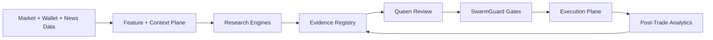

# Hivenance Heavy Architecture Integration Plan

Status: Layers 1-6 completed with first hardening pass

This record maps the research report into a phased architecture for Hivenance. The principle is evidence first: public repositories are treated as infrastructure and research references, not as trusted profit engines, until Hivenance reproduces their backtests and passes dry-run, paper, Queen, and SwarmGuard gates.

## Research Synthesis

The useful repositories fall into six architecture families:

- Execution-ready bot frameworks: Freqtrade, Hummingbot, Jesse.
- Event-driven parity engines: NautilusTrader, hftbacktest.
- ML and RL research labs: FreqAI, FinRL_Crypto, FinRL, TensorTrade, MacroHFT.
- Agentic context/risk references: WebCryptoAgent, FinRL_DeepSeek, PreBit.
- Visual workflow and operations references: Superalgos.
- Signal-marketplace patterns: Vanta Network, CandlesTAO, time-series Bittensor subnets.

The important lesson is not "plug these in and print money." The important lesson is to split Hivenance into a research-to-live pipeline where every signal, model, and external strategy must carry evidence, risk assumptions, and promotion status.

## Target Architecture

## Phase Record

| Layer | Name | Status | Purpose | Key Gates |
|---|---|---|---|---|
| 1 | Research Architecture Registry | Complete | Track external systems, evidence policy, and integration readiness | dry-run required, backtest metrics required, Queen review |
| 2 | Event + Config Spine | Complete | Add typed config, event schema, durable event metadata, and critical alerting | schema validation, rollback snapshot, operator audit, event envelope |
| 3 | Backtest Evidence Loop | Complete | Normalize Freqtrade/Jesse/Hummingbot/Hivenance backtest evidence | walk-forward, max drawdown, minimum trades |
| 4 | ML Research Lab | Complete | Add FreqAI/FinRL/MacroHFT/WebCryptoAgent candidates as offline-only model proposals | Layer 3 evidence, walk-forward, PBO check, leakage check, negative-case replay |
| 5 | Execution Parity | Complete | Model latency, slippage, queue position, and fill realism | latency budget, slippage budget, queue-position, fill-model audit |
| 6 | Signal Marketplace | Complete | Sandbox Bittensor-style validators/miners for strategy scoring | signed submissions, plagiarism check, drawdown elimination, realized outcomes, reward simulation |

## Layer 1: Research Architecture Registry

Implemented artifacts:

- `agents/research_architecture.py`
- `config/research_architecture_layers.yaml`
- `/architecture/plan.json`
- `integration_planes.json.research_architecture`

Layer 1 is intentionally read-only. It does not alter orders, strategies, wallet behavior, or live execution. It gives the system a live, inspectable map of the heavier integration work.

Acceptance criteria:

- The registry exposes active and planned layers over HTTP.
- The integration plane includes the registry snapshot.
- The registry records the evidence policy for promotion.
- The Docker UI can continue running without the registry config file because defaults exist in code.

## Layer 2: Event + Config Spine

Implemented artifacts:

- `agents/config_agent.py`
- `agents/event_spine.py`
- `/config_agent.json`
- `/config_agent/rollback`
- `/event_spine.json`
- `integration_planes.json.config_spine`
- `integration_planes.json.event_spine`
- `logs/config_audit.jsonl`
- `data/config_snapshots/settings-*.yaml`
- `data_store.event_envelopes`
- `buzz.system.alert`

Layer 2 moves runtime settings writes behind a typed `ConfigAgent` and moves buzz traffic through a typed `EventSpineAgent`. Existing agents can still read `cfg` while writes now pass through validation, snapshot creation, and audit logging. Buzz events now receive an envelope with `type`, `source`, `ts`, `seq`, `id`, `correlation_id`, and `severity` before being delivered to logging, kill switch, security, and durable storage.

Planned scope:

- Introduce a `ConfigAgent` with typed `get/set`, validation, audit trail, and rollback snapshots.
- Add a strict event envelope for buzz events using Pydantic.
- Persist typed event envelope metadata alongside raw event payloads.
- Route critical failures into alert records visible through the Queen/UI alert path.
- Defer Redis Streams replay to a later queue-hardening slice after the local envelope contract is stable.

Trade-off:

- Adds structure and safer reloads.
- Requires careful migration away from ad hoc direct `cfg` access.

Acceptance criteria:

- Runtime UI settings persist through `ConfigAgent`.
- Invalid or unsupported config fields are rejected before touching YAML.
- Live-mode changes still require `ARM LIVE`.
- Every accepted write creates a rollback snapshot.
- Every accepted write appends an audit event.
- The integration plane exposes ConfigAgent health.
- Buzz events are normalized through a typed envelope before agent fan-out.
- Event envelopes are stored durably for audit/replay analysis.
- Critical event types emit `buzz.system.alert` and are mirrored into security audit alerts.
- The integration plane and `/event_spine.json` expose EventSpine health.

## Layer 3: Backtest Evidence Loop

Implemented artifacts:

- `agents/evidence_registry.py`
- `/evidence.json`
- `integration_planes.json.evidence_registry`
- `integration_planes.json.evidence_records`
- `data_store.evidence_records`
- `buzz.evidence.recorded`
- Hivenance replay fee/slippage/walk-forward metadata
- Promotion gate requiring `review_ready` evidence

Layer 3 makes backtest output a typed evidence object instead of a loose metrics blob. Public-bot sidecar ingests and Hivenance replay results normalize into the same record shape with `source`, `engine`, `run_id`, `symbol`, `strategy`, comparable metrics, gate results, and a promotion verdict.

Implemented scope:

- Normalize Freqtrade, Jesse, Hummingbot, and Hivenance replay outputs.
- Store comparable metrics: net profit, max drawdown, exposure, trades, win rate, slippage assumptions, fee assumptions.
- Block promotion unless evidence satisfies policy.
- Attach evidence to worker scores and Queen decisions.

Trade-off:

- Slower promotion.
- Much better defense against overfit strategies.

Acceptance criteria:

- Public-bot backtest ingest creates a normalized evidence record.
- Hivenance replay creates a normalized evidence record per symbol with fee, slippage, exposure, and split-window metadata.
- Evidence records persist with gate verdicts for minimum trades, win rate, net profit, drawdown, fee model, slippage model, and walk-forward metadata.
- Promotion records carry evidence id and evidence verdict.
- Public-bot auto-promotion and paper-to-tiny-live promotion require `review_ready` evidence.
- The integration plane and `/evidence.json` expose EvidenceRegistry health and recent evidence.

## Layer 4: ML Research Lab

Implemented artifacts:

- `agents/ml_research_lab.py`
- `/ml/candidates.json`
- `integration_planes.json.ml_research_lab`
- `integration_planes.json.ml_model_candidates`
- `data_store.ml_model_candidates`
- `data/model_cards/*.json`
- `data/model_cards/*.md`
- `buzz.ml.candidate`
- `MLResearchLabAgent.validation_runner`
- `/ml/candidates.json` validation-runner POST path

Layer 4 adapts the useful EdgeK BEAST pattern into Hivenance: local inference and ML training are not live authority. They are a forge for candidates, receipts, model cards, negative cases, and reusable feature-pipeline artifacts. A model can only produce proposal weight, feature importance, or Queen review packets until Layer 3 evidence, walk-forward, PBO, leakage, and SwarmGuard/Queen gates pass.

Implemented scope:

- FreqAI-style model candidates.
- FinRL_Crypto-style walk-forward/PBO validation.
- MacroHFT/WebCryptoAgent ideas as offline proposal generators only.
- Model cards for data windows, leakage risks, regime assumptions, and reproducibility.
- Local inference forge cards: teacher identity separate from runtime identity, cloud-disabled replay requirement, candidate-only promotion channel.
- Crystallized compute receipts: feature schema, validation split, stale-regime policy, negative-case reuse boundary.
- Validation runner receipts binding candidates to persisted Layer 3 evidence IDs.
- Candidate validation packets carrying walk-forward windows, PBO scores, leakage reports, out-of-sample trade counts, drawdown, and negative-case replay receipts.
- Missing PBO/leakage/replay evidence fails the gate instead of creating implied approval.

Trade-off:

- Adds compute and experiment tracking burden.
- Keeps ML out of live execution until evidence is clear.

Acceptance criteria:

- ML proposals persist as offline-only candidates.
- Each proposal writes JSON and Markdown model cards.
- Candidate gates include Layer 3 evidence, walk-forward, PBO, leakage, out-of-sample trades, drawdown, and offline-only status.
- FreqAI, FinRL_Crypto, MacroHFT, and WebCryptoAgent proposal families are represented.
- The integration plane and `/ml/candidates.json` expose MLResearchLab health and candidates.
- Validation-runner proposals can attach a specific or latest Layer 3 evidence record.
- Validation receipts persist on the model card and include Layer 3 gate snapshots, walk-forward windows, PBO source, leakage checks, and negative-case replay details.
- Queen review remains proposal-weight-only; ML candidates still cannot place orders, control wallets, or bypass SwarmGuard.

## Layer 5: Execution Parity

Implemented artifacts:

- `agents/execution_parity.py`
- `/execution/parity.json`
- `integration_planes.json.execution_parity`
- `integration_planes.json.execution_parity_diagnostics`
- `data_store.execution_parity_diagnostics`
- `buzz.execution.parity`

Layer 5 adds an execution-realism diagnostic layer inspired by hftbacktest and NautilusTrader, but keeps the first slice intentionally local and offline. It scores Hivenance replay output for latency budget, slippage budget, queue-position risk, fill ratio, and fill-model audit status. The hardening pass overlays real `orders.placed_ts`, `orders.final_ts`, and `fills.ts` observations when available, and uses observed orderbook/depth fields from replay history for queue-position risk. These diagnostics can block a live-parity claim, but they do not authorize live execution.

Implemented scope:

- hftbacktest/Nautilus-inspired latency and fill modeling.
- Queue-position proxy from slippage, exposure, and failed exits.
- Queue-position refinement from observed spread, top-of-book depth, and order-size percentage of depth.
- Timestamp latency overlay from stored order/fill observations.
- Fill-realism audit from trades, slippage model, fee model, and open-position state.
- Replay diagnostics persisted separately from Layer 3 evidence.
- Side-by-side paper vs live drift diagnostics scaffolded as `not_available` until timestamped fill/orderbook data exists.

Trade-off:

- Uses conservative proxy models only where timestamp/orderbook observations are missing.
- Prevents misleading backtests from reaching live mode.

Acceptance criteria:

- Hivenance replay can emit an execution parity diagnostic per symbol.
- Diagnostics persist with parity id, evidence id, metrics, gates, and verdict.
- The integration plane and `/execution/parity.json` expose ExecutionParity health and recent diagnostics.
- Latency, slippage, fill ratio, queue-position, and fill-model-audit gates are explicit.
- Parity diagnostics remain `diagnostic_only`; they cannot place orders, control wallets, or bypass Queen/SwarmGuard.
- Missing orderbook/live timestamp data is represented as a drift-data gap, not as live parity.
- Real order/fill observations override proxy latency and fill-ratio metrics when present.

## Layer 6: Signal Marketplace

Implemented artifacts:

- `agents/signal_marketplace.py`
- `/signal/marketplace.json`
- `integration_planes.json.signal_marketplace`
- `integration_planes.json.signal_marketplace_rounds`
- `data_store.signal_marketplace_rounds`
- `buzz.signal.marketplace`

Layer 6 creates a sandboxed signal tournament inspired by Bittensor-style trading subnets. Hivenance workers act as miners by submitting strategy proposals. The marketplace validates signed proposal receipts, scores originality, stability, drawdown risk, and historical worker performance, then assigns simulated reward points. Rewards remain accounting-only and cannot move funds or bypass Queen/SwarmGuard.

Implemented scope:

- Internal validator/miner scoring loop inspired by Bittensor trading subnets.
- Workers submit signed proposal receipts through the council proposal path.
- Validators score strength, long-horizon realized outcomes, win rate, drawdown, originality, and stability.
- Duplicate/plagiarized signals are eliminated from reward eligibility.
- High-drawdown workers are eliminated from reward eligibility.
- Workers below the realized-outcome sample threshold receive neutral pending treatment instead of fabricated confidence.
- Rewards remain simulated points until explicitly enabled by operator policy.

Trade-off:

- Adds incentive-design complexity.
- Could become a strong internal strategy tournament if sandboxed tightly.

Acceptance criteria:

- Council proposal rounds create marketplace scoring records.
- Each round persists signed submissions, validator scores, gates, verdict, and simulated reward totals.
- The integration plane and `/signal/marketplace.json` expose SignalMarketplace health and recent rounds.
- Plagiarism/originality, drawdown elimination, realized-outcome scoring, reward simulation, and sandbox-only gates are explicit.
- Marketplace rewards are simulated-only; Layer 6 cannot place orders, control wallets, or authorize live execution.

## Current Next Step

Heavy architecture layers 1-6 are complete and the calibration hardening pass is now wired into runtime defaults. Public bot sidecar surfaces are enabled behind process boundaries, Hummingbot lifecycle activation is normalized to a validate-only dry-run sidecar command, local crypto-bot implementation discovery is exposed, all ML research families are enabled for offline proposal generation, venue orderbook snapshots feed `buzz.market.orderbook`, execution parity overlays real order/fill timestamps plus latest top-of-book depth, and marketplace validators use configurable long-horizon realized-outcome weights.

Deliberate live-fund gates remain in place: `dry_run` stays authoritative, marketplace rewards are simulated-only, public bot metrics cannot auto-promote by default, and market-making quote placement remains disabled unless explicitly armed. The next hardening work is empirical calibration of the newly exposed thresholds after enough venue/orderbook and realized-outcome samples accumulate.

## Conservative Wallet State

`main.load_config()` now loads `config/conservative_state.yaml` after the locked base settings file when present. This makes the current operating profile explicit and editable without requiring ownership changes to `config/settings.yaml`.

The active conservative profile is calibrated to the latest local wallet snapshots: roughly 76.91 USD estimated equity, about 53.8 USDC reserve, small ETH exposure, and watch-only MAGIC/BEAM balances. Active market selection is narrowed to liquid core markets only: `ETH/USD` as the primary market and `BTC/USD` as the secondary paper/research market. Small/Base experimental names and watch-only assets are excluded from active selection until their paper outcomes, exit quality, and validator evidence improve.

This profile keeps `dry_run: true`, `live_mode: false`, wallet approval checks on, quote placement off, public-bot auto-promotion off, daily spend capped at 1 USD, and maximum single notional capped at 1 USD.

## Phase 7.1 Phoenix Authority Reconciliation

The heavy architecture remains valuable, but its authority has been reconciled into one Phoenix chain.

- Config Agent: research configuration only; cannot arm live mode or restore unsafe snapshots.
- Event Spine: correlation and telemetry only; not a state or authority store.
- Evidence Registry: external evidence normalization only; all imports are `UNVALIDATED_IMPORT` and enter Phase 2.
- ML Research Lab: offline candidate generation only.
- Execution Parity: diagnostic model-versus-reality auditing across Phases 3, 5, and 6.
- Signal Marketplace: dormant sandbox with simulated rewards only.
- Hummingbot lifecycle: plan, monitor, list, and stop semantics only.
- Phase 6: sole live-order authority.
- Phase 7: sole scaling authority.

Legacy integrations cannot submit orders, promote live stages, resume halted live operation, or scale capital.
