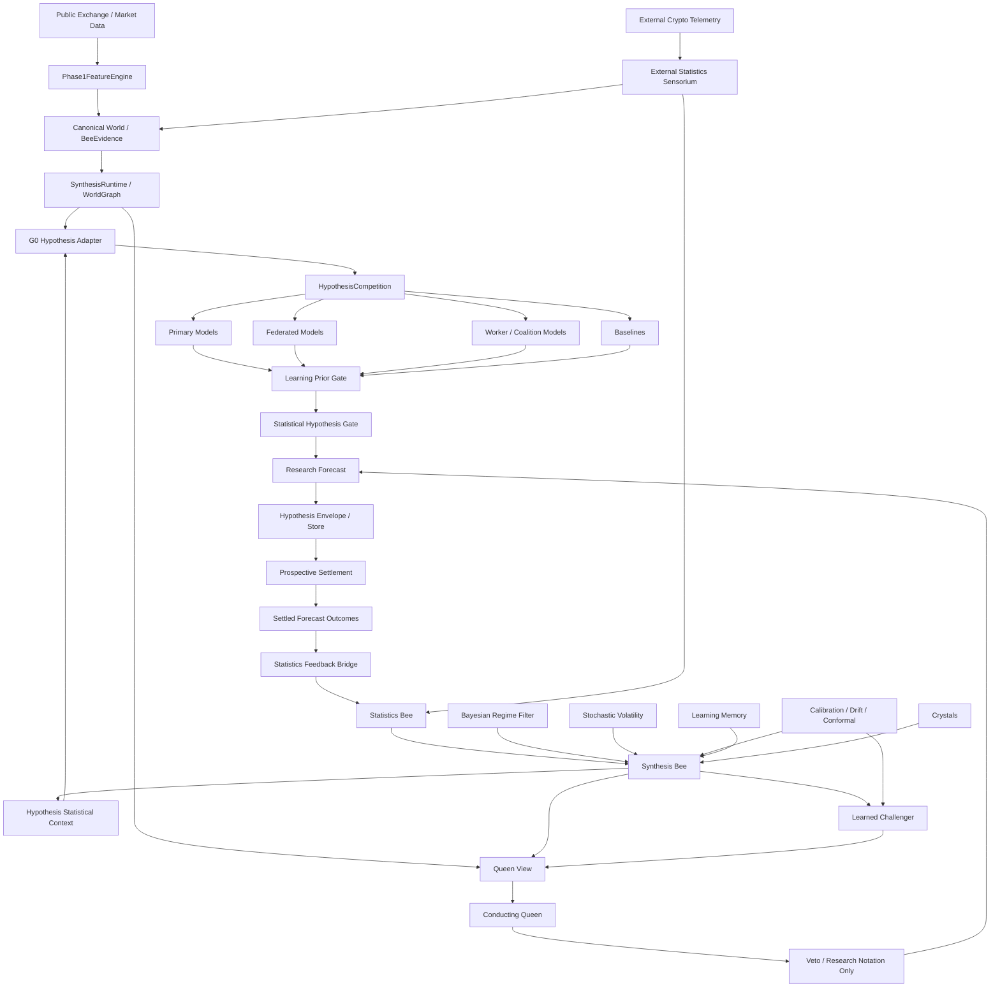

# Hivenance Phase 12.8 — Architecture Map and Optimization Audit

Branch: `phase12-learning-causality-audit`

## Executive architecture



## Two-speed organism

### Fast cognition path

```
market observation
  -> feature vector
  -> current point-in-time synthesis snapshot
  -> hypothesis competition
  -> learning prior
  -> statistical caution gate
  -> Queen challenge/veto
  -> frozen research forecast
```

This path must be cheap, deterministic, and local enough to run continuously.

### Slow learning path

```
frozen forecast
  -> future settlement
  -> realized after-cost outcome
  -> Statistics Bee
  -> Bayesian / regime / calibration updates
  -> Learning Memory
  -> Crystal candidacy
  -> next fast-path context
```

The slow path may update knowledge but must never mutate the already-frozen forecast that produced the outcome.

## Current canonical ownership

| Responsibility | Canonical owner |
| --- | --- |
| raw OHLCV / order-book feature construction | `volatility_breakout/feature_engine.py` |
| deterministic market regime hint | `feature_engine.py` |
| hypothesis generation / competition | `hypothesis_competition.py` |
| historical learning receipts | `learning_memory.py` |
| learning retrieval | `learning_retrieval.py` |
| rolling statistical evidence | `statistical_synthesis.py::StatisticsBee` |
| hierarchical probabilistic synthesis | `statistical_synthesis.py::SynthesisBee` |
| Bayesian regime posterior | `probabilistic_regime.py` |
| stochastic volatility / conformal / drift | `probabilistic_calibration.py` |
| external telemetry | `external_statistics.py` |
| settlement -> statistics feedback | `statistics_feedback_bridge.py` |
| statistics -> hypothesis seam | `hypothesis_statistics_bridge.py` |
| cognition graph composition | `synthesis_runtime.py` |
| learned ML dissent | `ml_challenger.py` |
| final research conductor | `conducting_queen.py` |

## Optimization findings

### 1. Statistics was previously too late in the path

Before Phase 12.8, statistical synthesis entered the WorldGraph / Queen path after many hypotheses had already been produced.

Repair:
- `g0_hypothesis_adapter.py` now binds the latest probabilistic synthesis before hypothesis evaluation.
- `HypothesisCompetition` now applies `statistical_hypothesis_gate` after its existing Learning prior.

Authority rule:
- statistics may annotate or veto;
- they may not originate direction;
- they may not flip direction;
- they may not increase execution or promotion authority;
- positive statistical evidence remains observational pending prospective causal proof.

### 2. The learning loop was open-ended

Settlement produced outcomes, but no canonical adapter fed them back into Statistics Bee.

Repair:
`statistics_feedback_bridge.py`

Canonical loop:
```
forecast -> settle -> StatisticalEvidence -> StatisticsBee -> synthesis -> next forecast
```

### 3. Statistics is now independently ablatable

New historical mask:
`NO_STATISTICS`

This permits same-world paired prosecution of:
```
FULL_HIVE vs NO_STATISTICS
```

A useful Statistics Bee must demonstrate decision changes and positive paired realized delta. Merely being invoked is not evidence of usefulness.

### 4. Regime currently has two representations

Current deterministic lane:
`feature_engine._classify_regime()`

Current probabilistic lane:
`BayesianRegimeFilter`

These should not silently overwrite each other.

Recommended next contract:
```
RegimeContext
  deterministic_hint
  deterministic_confidence
  bayesian_probabilities
  dominant_posterior_regime
  posterior_entropy
  change_point_probability
  evidence_cutoff
```

Hypothesis models should consume this context through one read seam.

### 5. Context keys are becoming fragmented

Current FeatureVector values may carry:
- `regime_inputs`
- `phase2_learning_feedback`
- `phase2_crystal_memory`
- `phase2_adaptive_thresholds`
- `synthesis_context`
- `phase2_statistical_hypothesis_context`

This is functional but will become difficult to reason about.

Recommended consolidation:
```
ResearchContext
  observed
  regime
  statistics
  learning
  crystals
  external
  calibration
  authority
  provenance
```

Adapters may preserve legacy keys temporarily, but new organs should read the canonical context.

### 6. Keep evidence generation separate from interpretation

The architecture should preserve three distinct levels:

```
OBSERVATION
raw market/external evidence

STATISTICS
what the observed history quantitatively says

INTERPRETATION
Bayesian synthesis / ML / Learning / Crystal / Queen
```

This prevents a model opinion from returning to the system disguised as observed market truth.

## Optimized target dataflow

```
                         +-------------------------+
                         | External Sensorium      |
                         | ETF / OI / funding /    |
                         | stablecoins / options   |
                         +-----------+-------------+
                                     |
                                     v
+-------------+    +-------------+  +---------------------+
| Exchange    |--->| Observation |->| Canonical Evidence  |
| market data |    | / Features  |  | + World State       |
+-------------+    +-------------+  +----------+----------+
                                                |
             +----------------------------------+------------------+
             |                                                     |
             v                                                     v
     +---------------+                                     +---------------+
     | Statistics Bee|<------ settled outcomes ------------| Forecast Store|
     +-------+-------+                                     +-------+-------+
             |                                                     ^
             v                                                     |
     +---------------+                                             |
     | Synthesis Bee |                                             |
     | Bayesian state|                                             |
     +-------+-------+                                             |
             |                                                     |
             v                                                     |
     +----------------------+                                      |
     | ResearchContext      |                                      |
     | point-in-time only   |                                      |
     +----------+-----------+                                      |
                |                                                  |
                v                                                  |
        +---------------+                                          |
        | Hypothesis     |------------------------------------------+
        | Competition    |
        +-------+-------+
                |
                v
        +---------------+
        | Learning gate |
        +-------+-------+
                |
                v
        +---------------+
        | Statistics    |
        | caution gate  |
        +-------+-------+
                |
                v
        +---------------+
        | ML / Queen    |
        | challenge     |
        +-------+-------+
                |
                v
        research forecast
```

## Next optimization sequence

1. Unify deterministic and Bayesian regime into `RegimeContext`.
2. Introduce canonical `ResearchContext`, with compatibility adapters for current FeatureVector keys.
3. Feed external statistics into hypothesis context only through normalized point-in-time features.
4. Add `NO_BAYES`, `NO_EXTERNAL`, `NO_CONFORMAL`, and `NO_ML` executable masks where runtime isolation is real.
5. Run paired historical replay:
   - FULL_HIVE
   - NO_STATISTICS
   - NO_BAYES
   - NO_REGIME
   - NO_EXTERNAL
   - NO_CONFORMAL
   - NO_ML
6. Promote no positive influence until prospective shadow evidence confirms it.
